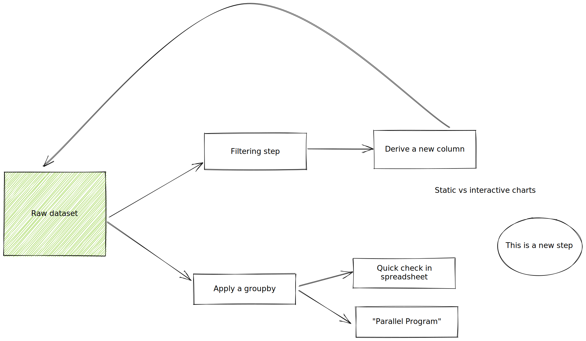

## Diagrams

A small demo showing how Excalidraw diagrams can be embedded into a README when using the `excalidraw.svg` filetype and VSCode Extension.

To try this live, press `.` when viewing this page on the web, and install the Excalidraw extension. It will also work with local VSCode installations.

## Related links

- I maintain the Figma/Figjam Excalidraw [Widget](https://www.figma.com/community/widget/1047391719101881118)
- VScode Extension: <https://github.com/excalidraw/excalidraw-vscode>

This same feature (storing app data in PNG, SVG, and JSON formats) is supported by several drawing extensions. Each system has its own strengths, choose what you like.

- TLDraw: <https://www.npmjs.com/package/tldraw-vscode>
- Draw.io: <https://marketplace.visualstudio.com/items?itemName=hediet.vscode-drawio>
